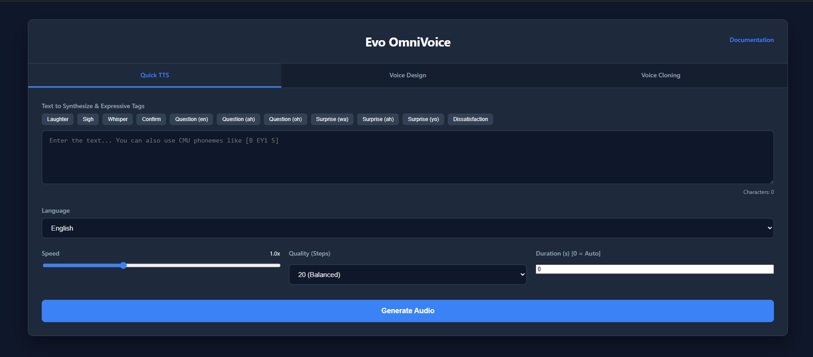

# 🎙️ Evo OmniVoice - Texto para Fala com IA

Sistema de **Text-to-Speech (TTS)** de alta qualidade baseado em IA, com suporte a **11 idiomas**, **clonagem de voz** e **expressões emocionais**.



---

## ✨ Recursos Principais

- 🌍 **11 Idiomas Suportados** - Português, Inglês, Espanhol, Francês, Alemão, Japonês e mais
- 🎭 **Tags Expressivas** - Adicione risos, suspiros, sussurros e emoções ao áudio
- 👤 **Clonagem de Voz** - Clone qualquer voz com apenas 3-10 segundos de áudio
- 🎨 **Design de Voz** - Crie vozes personalizadas com prompts descritivos
- ⚡ **Acelerado por GPU** - Usa NVIDIA CUDA para geração ultra-rápida
- 🔌 **API REST** - Integração fácil com outros aplicativos
- 📦 **100% Portátil** - Tudo fica dentro da pasta do projeto

---

## 💻 Requisitos do Sistema

### Mínimos
| Componente | Requisito |
|---|---|
| **Sistema Operacional** | Windows 10/11 (64-bit) |
| **Processador** | Qualquer CPU x64 |
| **Memória RAM** | 8 GB |
| **Espaço em Disco** | 8 GB livres |
| **Conexão Internet** | Necessária para instalação |

### Recomendados
| Componente | Requisito |
|---|---|
| **Placa de Vídeo** | NVIDIA RTX 3070 ou superior (8GB+ VRAM) |
| **Memória RAM** | 16 GB ou mais |
| **Espaço em Disco** | 15 GB livres |

> **Nota:** O sistema funciona sem GPU, mas será mais lento. Com GPU NVIDIA, a geração é **10x mais rápida**!

---

## 🚀 Instalação (Super Fácil!)

### Passo 1: Baixar o Projeto

```bash
git clone https://github.com/marksjr/EvoOmniVoice.git
```

Ou faça download do ZIP diretamente do GitHub.

### Passo 2: Instalar

1. Extraia a pasta para qualquer local (ex: `C:\EvoOmniVoice`)
2. Dê **duplo clique** em `install.bat`
3. Aguarde a instalação automática

O instalador fará automaticamente:
- ✅ Verificação de espaço em disco
- ✅ Download e instalação do Python portátil
- ✅ Download e instalação do FFmpeg
- ✅ Criação do ambiente virtual
- ✅ Instalação de todas as dependências
- ✅ Teste pós-instalação

> ⏱️ **Tempo estimado:** 10-30 minutos (depende da sua internet)

---

## 🎯 Como Usar

### Iniciar o Sistema

Dê **duplo clique** em `start.bat`

O sistema vai:
1. Verificar se está instalado
2. Detectar seu hardware (GPU/CPU)
3. Iniciar o servidor
4. Abrir a interface no navegador

> 🔄 **Na primeira vez**, o modelo será baixado automaticamente (~4-5 GB). Aguarde!

### Interface Web


#### Modo Quick TTS (Rápido)
1. Selecione o idioma desejado
2. Digite o texto
3. Ajuste velocidade e qualidade
4. Clique em **"Generate Audio"**

#### Modo Voice Design (Design de Voz)
1. Descreva a voz que deseja criar
2. Use os botões rápidos para selecionar atributos
3. Clique em **"Generate Audio"**

**Atributos válidos:**
- **Gênero:** male, female
- **Idade:** child, teenager, young adult, middle-aged, elderly
- **Tom:** very low pitch, low pitch, moderate pitch, high pitch, very high pitch
- **Sotaque:** american, british, australian, canadian, chinese, indian, japanese, korean, portuguese, russian
- **Estilo:** whisper

#### Modo Voice Cloning (Clonagem de Voz)
1. Faça upload de um áudio de referência (3-10 segundos)
2. (Opcional) Digite o transcript exato do áudio
3. Digite o texto que deseja sintetizar
4. Clique em **"Generate Audio"**

---

## 🌍 Idiomas Suportados

| Idioma | Código | Exemplo |
|---|---|---|
| 🇧🇷 Português | `pt` | Olá, como vai você? |
| 🇺🇸 Inglês | `en` | Hello, how are you? |
| 🇪🇸 Espanhol | `es` | Hola, ¿cómo estás? |
| 🇫🇷 Francês | `fr` | Bonjour, comment allez-vous? |
| 🇩🇪 Alemão | `de` | Hallo, wie geht es Ihnen? |
| 🇯🇵 Japonês | `ja` | こんにちは、お元気ですか？ |
| 🇳🇴 Norueguês | `no` | Hei, hvordan har du det? |
| 🇸🇪 Sueco | `sv` | Hej, hur mår du? |
| 🇩🇰 Dinamarquês | `da` | Hej, hvordan har du det? |
| 🇳🇱 Holandês | `nl` | Hallo, hoe gaat het? |
| 🇸🇦 Árabe | `ar` | مرحبا، كيف حالك؟ |

### Como usar os idiomas

No modo **Quick TTS**, basta:
1. **Selecionar o idioma** no menu dropdown
2. **Digitar o texto** no idioma desejado

**As tags expressivas** (`[laughter]`, `[sigh]`, etc.) funcionam em **qualquer idioma**!

---

## 🎭 Tags Expressivas

Adicione emoções e efeitos sonoros ao seu texto:

| Tag | Efeito |
|---|---|
| `[laughter]` | Risada |
| `[sigh]` | Suspiro |
| `[whisper]` | Sussurro |
| `[confirmation-en]` | Confirmação (en) |
| `[question-en]` | Pergunta (en) |
| `[question-ah]` | Pergunta (ah) |
| `[question-oh]` | Pergunta (oh) |
| `[surprise-wa]` | Surpresa (wa) |
| `[surprise-ah]` | Surpresa (ah) |
| `[surprise-yo]` | Surpresa (yo) |
| `[dissatisfaction-hnn]` | Insatisfação |

**Exemplo:**
```
[laughter] Olá! Que dia lindo! [sigh] Estou muito feliz hoje.
```

---

## 🔌 API REST

O sistema expõe uma API para integração com outros aplicativos.

### Status do Sistema
```
GET http://localhost:8081/api/status
```

**Resposta:**
```json
{
  "status": "online",
  "model_loaded": true,
  "gpu_available": true,
  "gpu_name": "NVIDIA GeForce RTX 3070"
}
```

### Gerar Áudio
```
POST http://localhost:8081/api/generate
Content-Type: application/json
```

**Corpo da requisição:**
```json
{
  "text": "Olá mundo, como vai você?",
  "language": "pt",
  "mode": "auto",
  "num_steps": 20,
  "speed": 1.0,
  "duration": 0
}
```

**Modos disponíveis:**
| Modo | Descrição |
|---|---|
| `auto` | Síntese automática (Quick TTS) |
| `instruct` / `design` | Design de voz com prompt |
| `clone` | Clonagem de voz |

**Parâmetros para clonagem:**
```json
{
  "text": "Texto para sintetizar",
  "language": "pt",
  "mode": "clone",
  "ref_audio": "BASE64_AUDIO_STRING",
  "ref_text": "Transcript do áudio de referência"
}
```

**Resposta:**
```json
{
  "success": true,
  "audio": "BASE64_WAV_STRING",
  "metrics": {
    "char_count": 28,
    "generation_time": 2.34,
    "gpu_used": true
  }
}
```

---

## ⚙️ Configurações

### Qualidade vs Velocidade
| Steps | Qualidade | Velocidade | Uso |
|---|---|---|---|
| 16 | Rápida | ⚡⚡ | Testes, protótipos |
| 20 | Balanceada | ⚡⚡ | Uso diário (padrão) |
| 32 | Alta | ⚡ | Produção, qualidade máximo |

### Velocidade do Áudio
- **0.5x** - Muito lento
- **1.0x** - Normal (padrão)
- **2.0x** - Muito rápido

### Duração Fixa
- **0** - Automático (recomendado)
- **1-30** - Duração fixa em segundos

---

## 📁 Estrutura do Projeto

```
EvoOmniVoice/
├── install.bat          ← Instalar o sistema
├── start.bat            ← Iniciar o sistema
├── server.py            ← Servidor FastAPI
├── index.html           ← Interface web
├── doc.html             ← Documentação
├── image.png            ← Screenshot da interface
├── README.md            ← Este arquivo
├── .gitignore           ← Arquivos ignorados pelo git
├── bin/                 ← Binários portáteis (baixados automaticamente)
└── venv/                ← Ambiente virtual (criado automaticamente)
```

---

## ❓ Problemas Comuns

### "Espaço insuficiente"
Libere pelo menos 8 GB de espaço em disco e tente novamente.

### "Falha ao baixar"
Verifique sua conexão com a internet. O instalador precisa baixar:
- Python (~25 MB)
- FFmpeg (~70 MB)
- PyTorch (~200 MB - 2 GB)
- OmniVoice e bibliotecas (~1 GB)

### "GPU não detectada"
Sem problema! O sistema funciona em CPU, apenas será mais lento.

### "Modelo demora na primeira vez"
É normal! O modelo OmniVoice será baixado (~4-5 GB). Nas próximas vezes será rápido.

### "Porta 8081 já em uso"
Feche outros programas usando a porta 8081 ou edite `server.py` para usar outra porta.

### "Erro ao gerar áudio"
- Verifique se o servidor está rodando
- Tente usar menos texto (máximo recomendado: 500 caracteres)
- Reinicie o sistema fechando e abrindo `start.bat`

---

## 💡 Dicas

1. **Primeiro uso:** Aguarde o modelo ser baixado completamente
2. **Qualidade:** Use 32 steps para melhor qualidade, 16 para mais velocidade
3. **Clonagem:** Use áudio limpo, sem ruído de fundo
4. **Expressões:** Tags como `[laughter]` funcionam melhor em inglês
5. **Português:** O modelo suporta português nativamente, basta selecionar "Portuguese"

---

## 📊 Performance Estimada

| Hardware | Velocidade de Geração |
|---|---|
| RTX 4090 | ~50 caracteres/segundo |
| RTX 3070 | ~30 caracteres/segundo |
| RTX 2060 | ~20 caracteres/segundo |
| CPU (i7) | ~5 caracteres/segundo |

> *Valores aproximados para texto em inglês com 20 steps*

---

## 🤝 Contribuindo

Contribuições são bem-vindas! Sinta-se à vontade para:
- Reportar bugs
- Sugerir melhorias
- Enviar pull requests

---

## 📄 Licença

Este projeto é distribuído para fins educacionais e de pesquisa.

---

## 🔗 Links

- [Repositório GitHub](https://github.com/marksjr/EvoOmniVoice)
- [Modelo OmniVoice Original](https://github.com/k2-fsa/OmniVoice)

---

**Desenvolvido com ❤️ para ser simples, portátil e poderoso**
